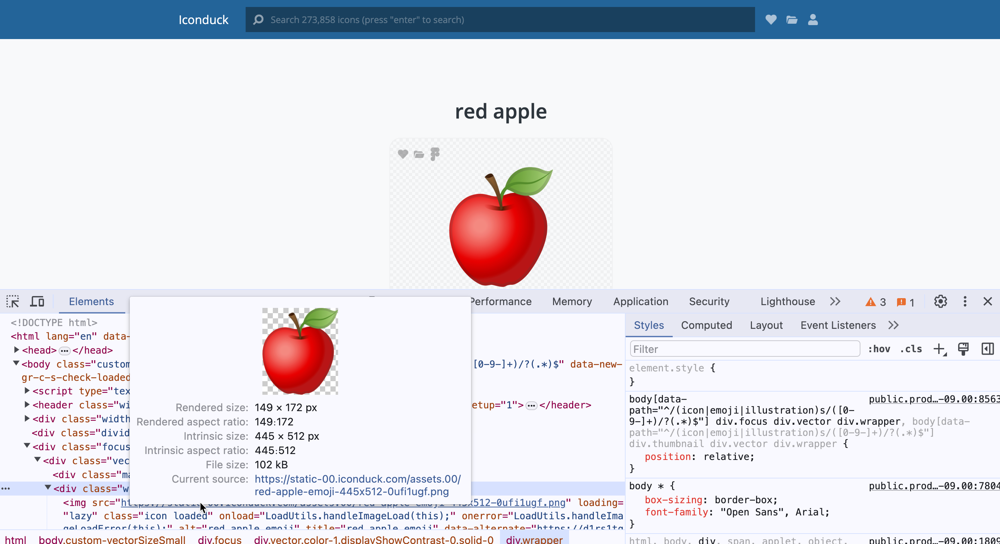

# Week 2: CSS

<figure><figcaption>
CSS provides style. Image from rawpixel.com.
</figcaption></figure>

CSS is the language that provides style. The complete set of styles provides the visual theme that makes a website whole.  The CSS coder provides instructions that ensure page layout, color, and font are executed with consistency, accessibility, and aesthetic value.
