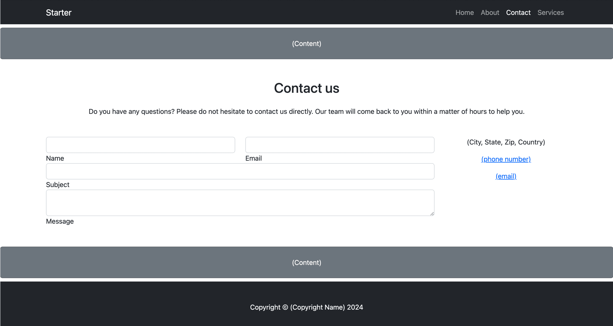

# Week 3: JavaScript and HTML Forms

<figure><figcaption>
Contact Form
</figcaption></figure>

Both front-end and back-end code use JavaScript.  It is the most popular computer language in the world.  It is versatile and easy to learn.  There is a large community of JavaScript developers who are continually teaching each other how to master the language and sharing innovations in its use.  In this course, you'll use it to make your web page dynamic and interactive.

Much of the activity on the web involves collecting and disseminating data.  Web forms are created using HTML, and the entered data is pulled from the document using JavaScript.  JavaScript has many functions and data structures that simplify working with data.
