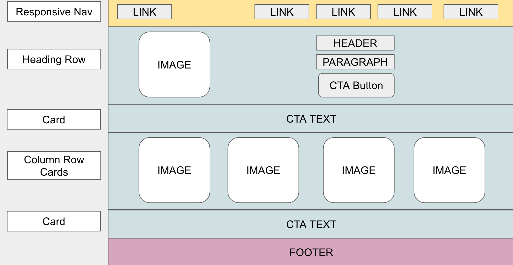

# Notes: Bootstrap

<figure><figcaption><p>Bootstrap Logo</p></figcaption></figure>

<figure><figcaption><p>Schematic of GetBootstrap Small Business Template Home Page.</p></figcaption></figure>

### Web Development Frameworks

Developers use frameworks to improve efficiency and consistency and minimize error.  The Bootstrap framework provides components of CSS shorthand and HTML, CSS, and JavaScript.  We'll be using Bootstrap CSS shorthand for the project.  Working with HTML, CSS, and JavaScript in the browser classifies our work as front end.  This differentiates it from backend development, which involves writing code for a server instead of a browser.

Frameworks are constructive when you are working on multiple pages or a team.  As you learn the Bootstrap shorthand, think about how confusing it would be if every developer on a team created their own CSS shorthand or if every page used its own set of CSS class names.  Bootstrap creates its shorthand using classes.

### Bootstrap and CSS

Bootstrap is [well-documented](https://getbootstrap.com/docs/5.3/getting-started/introduction/).  Visit the documentation to learn how Bootstrap has created a shorthand for CSS.  We will link a local stylesheet containing Bootstrap's CSS to use it in the document.

```html
<link href="./css/styles.css" rel="stylesheet" />
```

#### Bootstrap Container Class

The `container` class is essential in Bootstrap for layout. It contains centers and pads  the elements it contains.  So, if a developer wants to layout items on a web page, they will likely turn to a `container` to do so.  You can use this class on every page and be confident that it means the same thing as long as every page links the same stylesheet.  The Bootstrap container is responsive and manages padding and margins across different device ranges.

```html
<div class="container">
  <!-- Content here -->
</div>
```

### Responsive Device Ranges

Bootstrap manages responsive pages using sizes like T-shirt sizes. The table below shows the cutoff points for each size. If the viewport is less than 575px, it is considered very small. After that, the cutoff points for viewports are designated by the minimum value of the range. So, a small device is between 576px and 765px, and a Medium device is between 768px and 991px. &#x20;

It helps to picture mobile devices like a cell phone as X-Small and a tablet as Small.  After that, the sizes refer to laptops and desktop monitors of different sizes.

<table><thead><tr><th width="140">X-Small</th><th width="92">Small</th><th>Medium</th><th width="93">Large</th><th>X-Large</th><th>XX-Large</th></tr></thead><tbody><tr><td>up to 575px</td><td>576px</td><td>768px</td><td>992px</td><td>1200px</td><td> 1400px</td></tr></tbody></table>

The code below shows a series of containers that will adjust their sizes at different breakpoints.

```
<div class="container-sm">100% wide until small breakpoint</div>
<div class="container-md">100% wide until medium breakpoint</div>
<div class="container-lg">100% wide until large breakpoint</div>
<div class="container-xl">100% wide until extra-large breakpoint</div>
<div class="container-xxl">100% wide until extra extra large breakpoint</div>
```

The container class works with the `row` and `col` classes to implement responsive flexbox layouts.  The `col` class also uses the sizing values used by the container class.

Here is an example of the implementation of a FlexBox layout using Bootstrap.  We'll look at the meaning of `gx` and `p` shortly.  Notice that the two `col` elements are children of the element with the `row` class, and the elements of the `row` class are children of the `container` element.

```html
<div class="container px-4 text-center">
  <div class="row gx-5">
    <div class="col">
     <div class="p-3">Custom column padding</div>
    </div>
    <div class="col">
      <div class="p-3">Custom column padding</div>
    </div>
  </div>
</div>
```

The above code can be found in the [bootstrap documentation](https://getbootstrap.com/docs/5.3/layout/gutters/#horizontal-gutters), showing you what it renders.

### Summary of Bootstrap Classes

The table below summarizes the Bootstrap classes we'll encounter in the project.


| Class | Meaning |   |
| ----- | ------- | - |
|       |         |   |
|       |         |   |
|       |         |   |

###

### StartBootstrap Templates

The Start Bootstrap Templates&#x20;

### StartBootstrap Small Business Starter


