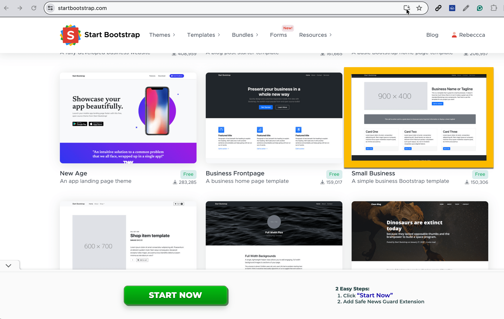

# StartBootstrap Templates

<figure><figcaption>
Small Business Template on Start Bootstrap website.
</figcaption></figure>

[**Start Bootstrap**](https://startbootstrap.com/) is a website that offers templates made using the Bootstrap framework. Many of these templates are free to use. We can look at demos and then download the website to modify it.

For the project in this section, we'll be using the Small Business template outlined above in gold.  Take time to look at the collection of templates.  There may be others you will want to work on in the future.

These templates contain the web languages we've been learning.   Working on one of these templates is similar to working on existing websites but requires feature enhancements.  The new feature may be content in the form of text or images.  There may also be requirements to add JavaScript in order to share data with the user and obtain data from the user.
