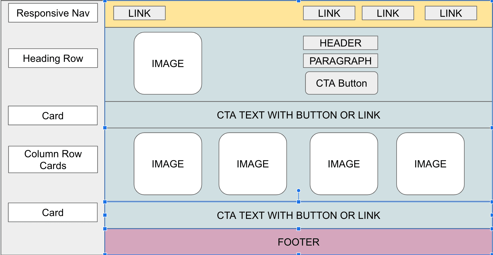
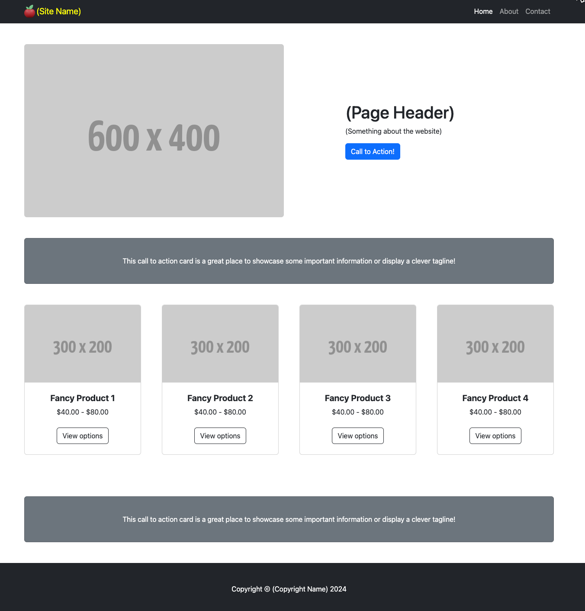

# Project: Bootstrap Website

<figure><figcaption><p>Schematic of Get Bootstrap Small Business Template from Start Bootstrap</p></figcaption></figure>

### StartBootstrap Small Business Starter

Adding features and content to an existing project starts with understanding the existing code.  The key is to look for patterns in the code and recognize what they are rendering. Drawing a schematic diagram like the one above that captures the patterns on the index page of the Small Business starter helps to see the code patterns.

The page starts with a nav bar containing links to other pages. Then comes the heading row, which includes an image lined up with three rows of header, paragraph, and call-to-action button (CTA). The CTA will show up in several places, sometimes rendered as a button and sometimes as a card. The card may contain just text with a link or it may include a button. The CTA encourages the user to take some action.

For this project, we'll import the GitHub repository [bootstrap-small-business](https://github.com/rebeccapeltz/bootstrap-small-business) into replit.com. This repository is modified from the Start Bootstrap Small Business starter.  The starter only shows the index page.  Our modified repository contains additional pages for **about**, **contact**, and **service**.  The **nav** bar is set up in the index.html to access About and Contact.  Images have been added to the home page cards, and images are rendered that specify the image size needed.


### New Feature Requirements

<figure><figcaption><p>Home Page for Small Business Modified Starter</p></figcaption></figure>

Here are the steps to fulfill the requirements for adding content and features:

1. Import the  [bootstrap-small-business](https://github.com/rebeccapeltz/bootstrap-small-business) repository into a replit.com account
2. Render the home page and look at the code used to create it
3. Choose a business that will add content.  Your content will include text and images.  See the notes on content to find content.  Think about calls to action: what actions do you want your user to take?  In the code, you'll see that you can pop up an alert to indicate that action was taken as a button click.
4. Notice that some of the information is in parentheses. For that missing information, add data relevant to your business.
5. Add images to the home page.  These images represent products that your business sells.
6. Add Nav bars to the **about** and **contact** pages.  The **services** page is optional, but if you want to add that to your website, add it to each nav bar item list.  The links and the active class must be adjusted for each web page.  For example, on the home page, each product has a button.  In an e-commerce website, this button would take the user to a page where they see more information about the product.  You could create a page for each project or add an on-click alert, as shown in the examples below.

```html
<button onclick="alert('Button clicked!')">Click Me</button>
<a class="btn btn-outline-dark mt-auto" href="#" onclick="alert('Product 1 selected')">View options</a>

```

7. For text content, you can write your own or explore some of the results you get from AI.  The Microsoft Edge and Chrome browsers often generate lengthy responses that can help fill out the text content.  You can also sign up for free accounts at  [ChatGP](https://chat.openai.com/) and [Gemini](https://gemini.google.com/app).
8. The project comes with a favicon and brand icon featuring an apple. The favicon can be seen in the browser tab. The brand image is in the upper left corner of the nav bar.  This image came from downloading an icon image from [Iconduck](https://iconduck.com/).  To download this image, click on the icon and view its details.  Then, inspect the icon's image and open it in another tab to download it. Then, upload it into your replit.com project. 
9. There are three CSS files in the project. The **styles.css** contains the Bootstrap-generated CSS. The **stickyfooter.css** creates a footer that is always located at the bottom of the page, even if the content doesn't extend to that. The **custom.css** is a place where you can add your own CSS. Sometimes, you need to override the Bootstrap CSS, and the customer.css file should contain those overrides.  Load the services.html in your browser to see how the sticky footer looks.
10. On the About page, there are links for email and phone.  Try these out.  The `hrefs` for these links specify `tel` and `mailto`.  These prefixes will trigger the browser to locate an app that can use phone numbers or email data. &#x20;
11. Fill in the Copyright information.  This should be your name or the name of your business.

###

###

### Start Bootstrap License

This software includes the start Bootstrap: Copyright (C) 2023

Permission is hereby granted, free of charge, to any person obtaining a copy of this software and associated documentation files (the "Software"), to deal in the Software without restriction, including without limitation the rights to use, copy, modify, merge, publish, distribute, sublicense, and/or sell copies of the Software, and to permit persons to whom the Software is furnished to do so, subject to the following conditions:

The above copyright notice and this permission notice shall be included in all copies or substantial portions of the Software.

###

###
